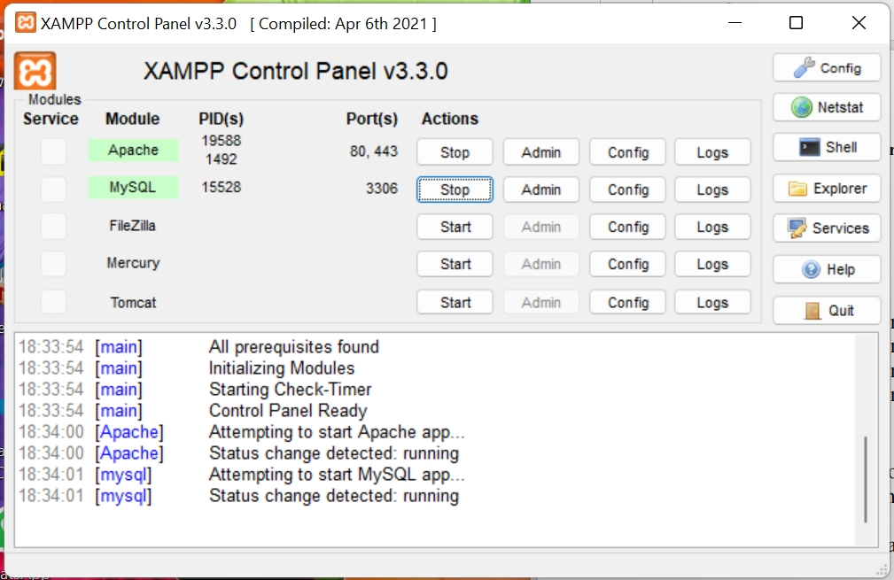
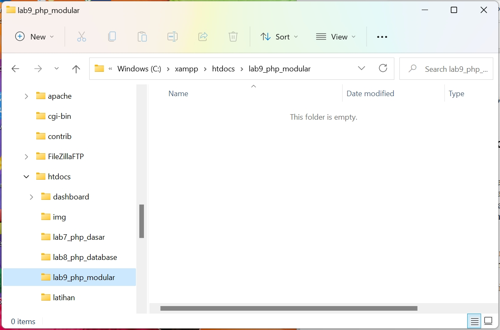
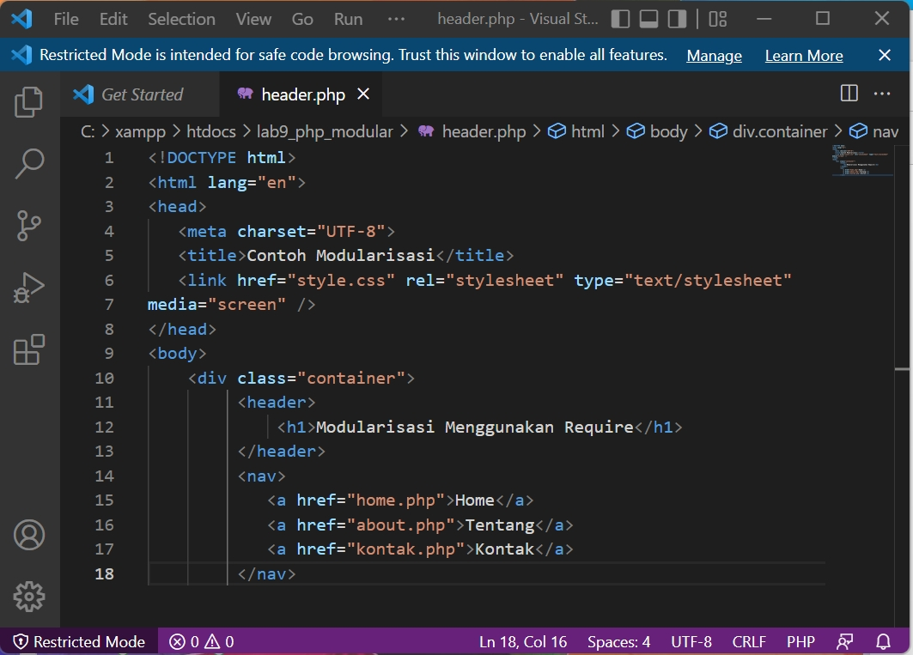
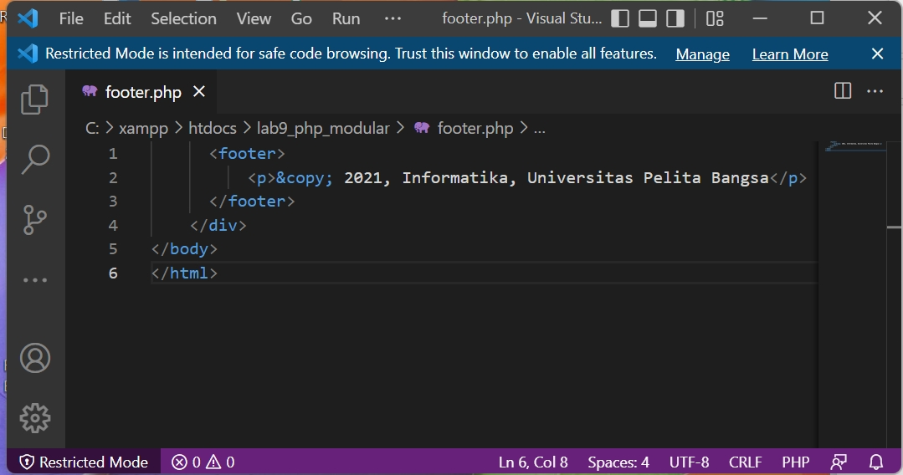
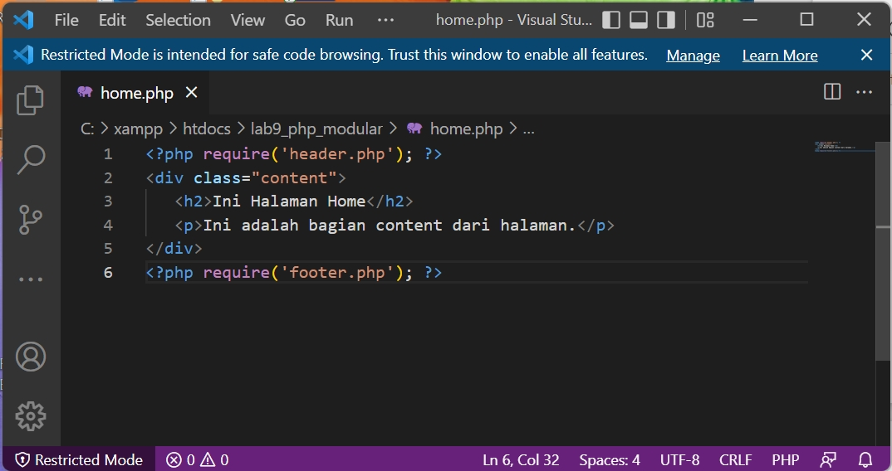
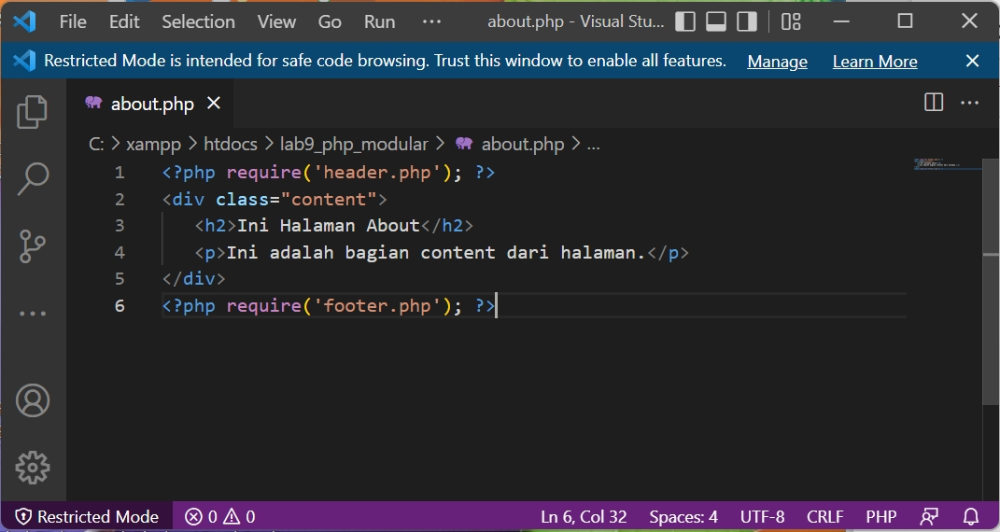
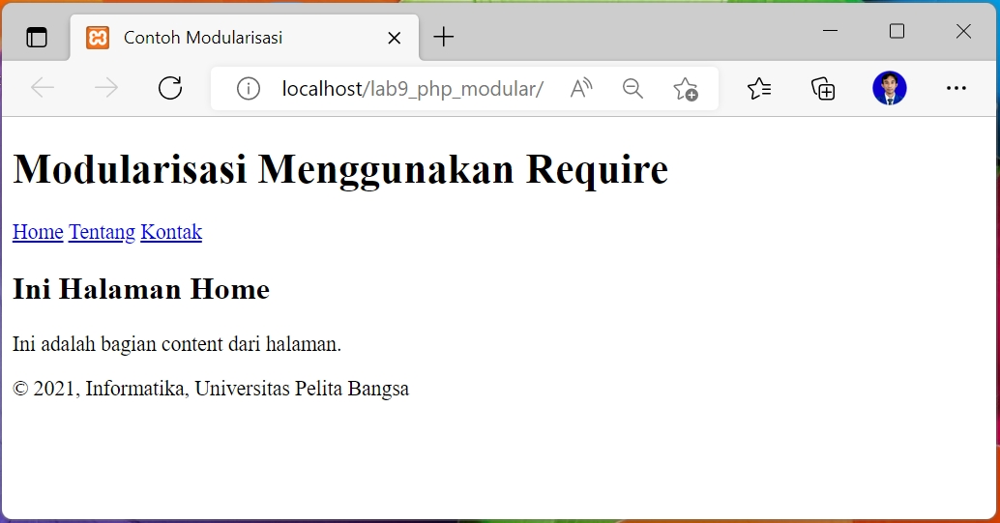

# 09_Lab9Web

TUGAS PERTEMUAN 11

PEMROGRAMAN WEB

TEKNIK INFORMATIKA

UNIVERSITAS PELITA BANGSA

NAMA  : GUNAWAN

NIM   : 312010191

KELAS : TI.20.B1

DOSEN : Agung Nugroho,S.Kom.,M.Kom

# Pemrograman Web: PHP Modular

**Instruksi Praktikum**
1. Persiapkan text editor misalnya **VSCode**. 
2. Buat folder baru dengan nama **lab9_php_modular** pada docroot webserver
(htdocs)
3. Ikuti langkah-langkah praktikum yang akan dijelaskan berikutnya.  

**Menjalankan MySQL Server** 
Untuk menjalankan MySQL Server dari menu XAMPP Contol.

Gambar 01. XAMPP Control

Buat folder **lab9_php_modular** pada root directory web server (C:\xampp\htdocs)

Gambar 02. Directory Lab9

**Langkah-langkah Praktikum** 
Buat file baru dengan nama **header.php4**. 
~~~
<!DOCTYPE html>
<html lang="en">
<head>
<meta charset="UTF-8">
<title>Contoh Modularisasi</title>
<link href="style.css" rel="stylesheet" type="text/stylesheet"
media="screen" />
</head>
<body>

<header>
<h1>Modularisasi Menggunakan Require</h1>
</header>
<nav>
<a href="home.php">Home</a>
<a href="about.php">Tentang</a>
<a href="kontak.php">Kontak</a>
</nav>
~~~

Gambar 03. Code header

Buat file baru dengan nama **footer.php**
~~~
<footer>

&copy; 2021, Informatika, Universitas Pelita Bangsa

</footer>

</body>
</html>
~~~

Gambar 04. Code footer

Buat file baru dengan nama **home.php**.
~~~
<?php require('header.php'); ?>

<h2>Ini Halaman Home</h2>

Ini adalah bagian content dari halaman.

<?php require('footer.php'); ?>
~~~

Gambar 05. Code home

Buat file baru dengan nama **about.php**.
~~~
<?php require('header.php'); ?>

<h2>Ini Halaman About</h2>

Ini adalah bagian content dari halaman.

<?php require('footer.php'); ?>
~~~

Gambar 06. Code about

Kemudian untuk mengakses direktory tersebut pada web server dengan mengakses URL: 
http://localhost/lab9_php_modular/

Gambar 07. Tampilan Web

**Pertanyaan dan Tugas**

Implementasikan konsep modularisasi pada kode program praktikum 8 tentang
database, sehingga setiap halamannya memiliki template 

>**Jawab**:

